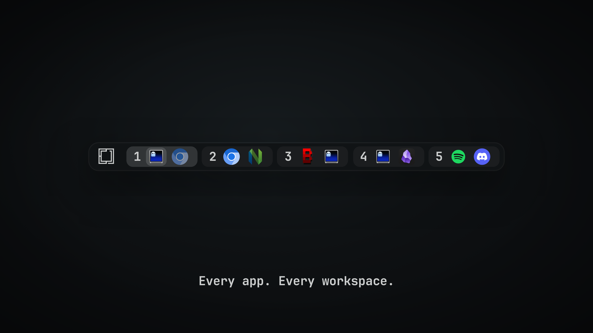
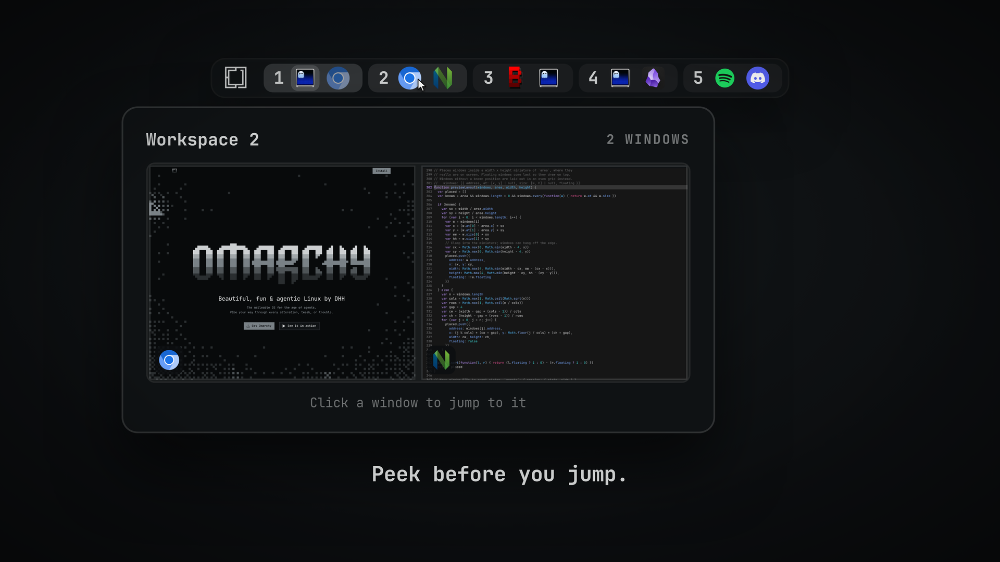
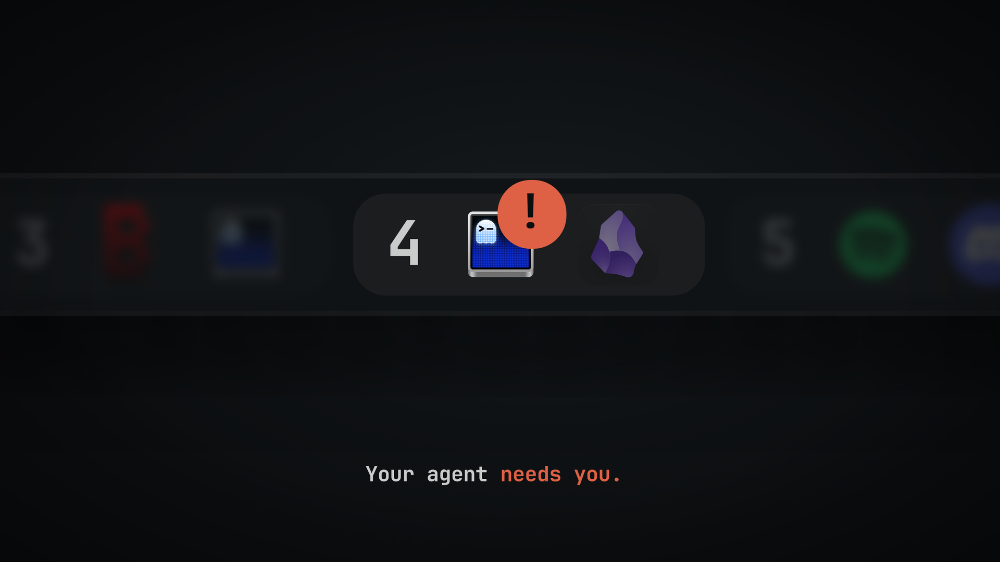
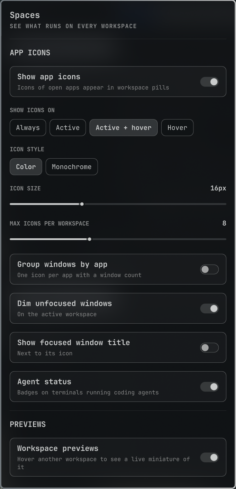

<h1 align="center">Spaces</h1>

<h3 align="center">See what runs on every workspace.</h3>

<p align="center">
  
</p>

Spaces is a workspace switcher for the [Omarchy](https://omarchy.org) bar. Each workspace shows the icons of the apps open on it. The active one slides open, and the focused window is highlighted.

This fork adds window controls from workspace-taskbar to [Tornike Gomareli's Spaces](https://github.com/tornikegomareli/omarchy-spaces). Minimized windows stay in their original workspace pill, the desktop control sits at the far end of the bar, and window actions use Omarchy's native menus. The existing previews, settings, optional app grouping and agent badges remain part of Spaces.

## Window controls

- Click a focused window to minimize it; click its dimmed icon to restore it. Turn this behavior off in settings if you prefer focus-only clicks. Grouped app icons keep cycling; their context menu lets you choose a specific window.
- Use the narrow strip at the far right of the bar (bottom on a vertical bar) to hide that monitor's active workspace windows. Click again to restore that batch. Windows minimized separately stay minimized.
- Right-click an app icon for minimize/restore, maximize, move to another workspace or monitor, scratchpad, Pop out, floating, fullscreen, pseudo, grouping, pinning or close. Availability follows the selected window's state.
- Pin an application from its window menu. Closed applications appear in a compact launcher pill; a running or minimized application keeps its place in its workspace. Pinning and launching use Omarchy's AppLibrary; workspace icons retain upstream Spaces' desktop-entry and icon lookup.
- Right-click a workspace label for workspace actions, including restoring its minimized windows. The layout switch is available on the focused workspace.
- Minimized windows keep their place in the spatial preview, using the original placeholder instead of a live capture. Click to restore. The `+N` overflow opens a complete window list. Menus support arrows, Tab, Enter and Escape and scroll when necessary.
- Settings include Restore last, Restore all and Recover hidden windows, plus visible diagnostics for failed operations or an unavailable helper.

The helper saves workspace, monitor, floating geometry, fullscreen, pin, pseudo and group state before hiding windows. Recovery retains unfinished operations for retry. It does not reconstruct the exact tiling tree. See [verification and remaining release checks](docs/verification.md).

## Peek before you jump

Hover another workspace to see it live, laid out the way it is on screen. Click a window in the preview to jump to it.

<p align="center">
  
</p>

## Know when your agent needs you

Terminals running Claude Code get a badge: a spinner while the agent works, a pulsing `!` when it needs your input, and a check mark when it is done. A workspace with an agent waiting on you pulses too.

<p align="center">
  
</p>

To turn it on, add these hooks to `~/.claude/settings.json`:

```json
{
  "hooks": {
    "UserPromptSubmit": [{ "hooks": [{ "type": "command", "command": "~/.config/omarchy/plugins/tornikegomareli.spaces/hooks/claude-hook working", "async": true }] }],
    "PostToolUse": [{ "hooks": [{ "type": "command", "command": "~/.config/omarchy/plugins/tornikegomareli.spaces/hooks/claude-hook working", "async": true }] }],
    "Notification": [{ "hooks": [{ "type": "command", "command": "~/.config/omarchy/plugins/tornikegomareli.spaces/hooks/claude-hook waiting", "async": true }] }],
    "Stop": [{ "hooks": [{ "type": "command", "command": "~/.config/omarchy/plugins/tornikegomareli.spaces/hooks/claude-hook done", "async": true }] }],
    "SessionEnd": [{ "hooks": [{ "type": "command", "command": "~/.config/omarchy/plugins/tornikegomareli.spaces/hooks/claude-hook end", "async": true }] }]
  }
}
```

Other agents can report the same way: `omarchy-shell tornikegomareli.spaces agent <session> <working|waiting|done|end> <pids>`, where `<pids>` lists the agent's process and its parents, comma-separated.

## Install

```sh
git clone --branch feature/window-controls https://github.com/48hoursnonstop/omarchy-spaces.git \
  ~/.config/omarchy/plugins/tornikegomareli.spaces
~/.config/omarchy/plugins/tornikegomareli.spaces/scripts/install.sh
```

Requirements:

- Omarchy 4.0.4 with its Quickshell bar; reviewed with Quickshell 0.3.1
- Hyprland **0.56.x**, using its Lua dispatcher API
- Rust 1.89 or newer, Cargo, a C linker, Python 3 and `jq`
- Official Hyprbars through `hyprpm`; for a first build: Git, cpio, CMake, Meson, GCC and Make
- Claude Code, only for agent status

This fork keeps the plugin ID `tornikegomareli.spaces`, so it replaces an upstream Spaces installation and preserves its settings and agent hooks. If that directory already exists, use your existing checkout to switch to this fork's branch; do not clone over it. `install.sh` validates, builds the helper, installs Hyprbars and replaces the built-in workspace switcher in its existing position. It records the prior placement/settings for uninstall and checks both Spaces and Hyprbars before reporting success. Do not enable directly before installation.

Its helper, preferences, lock and hidden workspace use their own Spaces namespace. It does not import workspace-taskbar's restore journal or take ownership of windows hidden by that plugin. Restore those windows with workspace-taskbar before replacing it. Hyprbars controls must have only one owner; remove any previous titlebar integration before installing this one.

To update, then load the new code:

```sh
~/.config/omarchy/plugins/tornikegomareli.spaces/scripts/update.sh
```

Updates follow the installed Git branch, build the candidate helper before changing the running version, and refresh Hyprbars. Local source changes stop an update. A failed activation restores the previous source and helper while retaining the recovery journal. Use this script instead of `omarchy plugin update`, which follows the remote's default branch and does not build the helper.

## Remove

```sh
~/.config/omarchy/plugins/tornikegomareli.spaces/scripts/uninstall.sh --yes
```

Uninstall removes the Spaces widget and plugin settings, its managed Lua import/configuration, helper binaries, cache, restore journal, preferences and installed source. It restores the workspace switcher's previous position/settings and removes the exact Claude command hooks shown above while retaining other hooks. No source backup is left behind. If installed through a symlink, only the installation link is removed; the development checkout remains.

Hidden windows are restored and recovery is verified before their journal/helper are deleted. A failure stops cleanup with recovery data retained for retry. Pre-existing Hyprbars installations and repositories shared by other plugins are preserved. The empty session lock inode remains until logout to avoid allowing concurrent processes to acquire different locks.

Add `--keep-settings` to retain pins and application overrides explicitly. Any custom keybinding you wrote yourself in `~/.config/hypr/bindings.lua` must be removed manually; the installer does not add keybindings. Do not use `omarchy plugin remove` alone while windows are minimized. See [production installation and removal](docs/production.md).

## Using it

- Click a workspace to go there. Click an icon to focus, minimize or restore its window.
- Scroll over the widget to move between workspaces.
- Hover an icon to see the window title.
- Hover another workspace to preview it. Click a window in the preview to focus it.
- Right-click the widget background, or click its gear, to open settings. Right-click an app icon for its window menu.

## Settings



Choose when icons show (always, active, on hover, or never), icon style and size, grouping by app, previews, agent status, the active workspace style, density, and more. Settings are saved to `~/.config/omarchy/shell.json`.

The workspace pills retain the upstream appearance, including icon lookup and animations. New actions live in context menus and Hyprbars. The separate desktop strip occupies the far end of the bar; no buttons are inserted into workspace pills or preview cards.

To open settings with a key, add this to `~/.config/hypr/bindings.lua`:

```lua
o.bind("SUPER + CTRL + ALT + S", "Spaces settings", "omarchy-shell tornikegomareli.spaces toggle")
```

To preview a workspace from a key or script, without hovering:

```sh
omarchy-shell tornikegomareli.spaces peek 3
```

Settings can also be set from a script:

```sh
omarchy bar set tornikegomareli.spaces showApps all
```

<br clear="right" />

## Development

From a clone, run tests without installing or changing your desktop:

```sh
export CARGO_TARGET_DIR="${XDG_CACHE_HOME:-$HOME/.cache}/omarchy-spaces-dev/cargo-target"
cargo test --manifest-path backend/Cargo.toml --locked
cargo build --manifest-path backend/Cargo.toml --locked --release
SPACES_TEST_BINARY="$CARGO_TARGET_DIR/release/spaces-backend" python3 tests/backend/test_transactions.py
tests/smoke/static.sh
python3 tests/smoke/lifecycle.test.py
python3 tests/smoke/update.test.py
scripts/check-qml.sh
python3 tests/qml/service.test.py
# Optional graphical test: requires labwc and wtype; starts its own compositor.
python3 tests/qml/ui.test.py
```

Build outputs must stay outside the recursively watched plugin source tree. `scripts/build-backend.sh` builds in XDG cache and atomically installs the helper into XDG data. The QML service uses protocol 6 and refuses incompatible helpers. Rebuild after helper changes; the source itself hot-reloads when installed.

## Recovery and diagnostics

```sh
~/.config/omarchy/plugins/tornikegomareli.spaces/scripts/doctor.sh
omarchy-shell tornikegomareli.spaces status
omarchy-shell tornikegomareli.spaces showDesktop 3
omarchy-shell tornikegomareli.spaces restoreLast
omarchy-shell tornikegomareli.spaces restoreAll
omarchy-shell tornikegomareli.spaces recover
```

The IPC replies indicate queuing; check settings or `status` for the eventual result. If the shell cannot load, run the helper directly:

```sh
~/.local/share/tornikegomareli.spaces/bin/spaces-backend --protocol 6 recover
```

Default paths (all honor their corresponding XDG variable):

| Data | Location |
| --- | --- |
| Helper | `~/.local/share/tornikegomareli.spaces/bin/spaces-backend` |
| Restore journal | `~/.local/state/tornikegomareli.spaces/restore-v1.json` |
| Pins and application overrides | `~/.config/tornikegomareli.spaces/` |
| Build cache | `~/.cache/tornikegomareli.spaces/` |

Application overrides select an existing AppLibrary desktop entry, for example `{"matches":{"window-class":"desktop-entry-id"}}` in `overrides.json`. A missing icon uses a placeholder; Spaces does not scan icon directories or replace the launcher's icon choices.

## Titlebar controls

The standard installer includes minimize, maximize/restore and close buttons through the official Hyprbars plugin and `hyprpm`. Double-clicking the titlebar toggles maximized state through the same helper. Colors follow Omarchy's current theme; full-screen windows and applications advertising game content have no titlebar.

Use `scripts/setup-hyprbars.sh --status` to inspect the integration or `--check` for its preflight. `scripts/doctor.sh` treats missing or unloaded Hyprbars as a failed installation. The script retains ownership metadata when removal fails, so cleanup can be retried. Spaces does not add an empty-titlebar context menu.

## License

[MIT License](LICENSE), with the original Spaces attribution preserved. The backend, application matcher, service/menu foundation and maintenance tools adapted from workspace-taskbar retain their [MIT attribution](LICENSE.workspace-taskbar).
