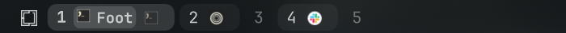
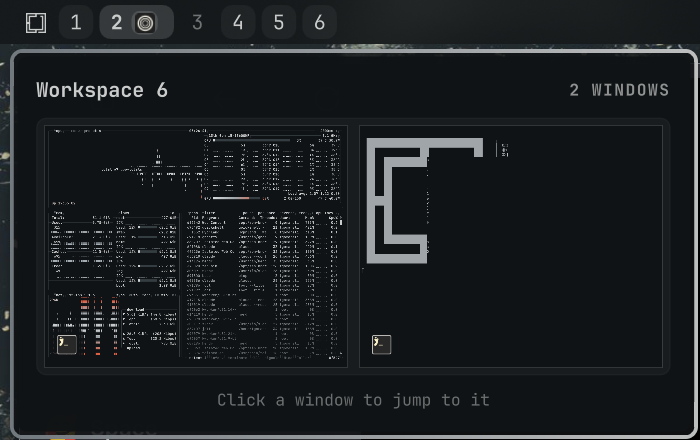

<h1 align="center">Spaces</h1>

<h3 align="center">See what runs on every workspace.</h3>

<p align="center">
  
</p>

Spaces is a workspace switcher for the [Omarchy](https://omarchy.org) bar. Each workspace shows the icons of the apps open on it. The active one slides open, and the focused window is highlighted.

Hover another workspace to see it live, laid out the way it is on screen. Click a window in the preview to jump to it.

<p align="center">
  
</p>

## Install

```sh
omarchy plugin add https://github.com/tornikegomareli/omarchy-spaces.git --enable
omarchy plugin disable omarchy.workspaces   # optional: replace the built-in switcher
```

Requires Omarchy with the Quickshell bar and Hyprland.

## Using it

- Click a workspace to go there. Click an icon to focus that window.
- Scroll over the widget to move between workspaces.
- Hover an icon to see the window title.
- Hover another workspace to preview it. Click a window in the preview to focus it.
- Right-click the widget, or click the gear that shows on hover, to open settings.

## Agent status

Terminals running Claude Code get a badge: a spinner while the agent works, a pulsing `!` when it needs your input, and a check mark when it is done. A workspace with an agent waiting on you pulses too.

Add these hooks to `~/.claude/settings.json`:

```json
{
  "hooks": {
    "UserPromptSubmit": [{ "hooks": [{ "type": "command", "command": "~/.config/omarchy/plugins/insanearts.spaces/hooks/claude-hook working", "async": true }] }],
    "PostToolUse": [{ "hooks": [{ "type": "command", "command": "~/.config/omarchy/plugins/insanearts.spaces/hooks/claude-hook working", "async": true }] }],
    "Notification": [{ "hooks": [{ "type": "command", "command": "~/.config/omarchy/plugins/insanearts.spaces/hooks/claude-hook waiting", "async": true }] }],
    "Stop": [{ "hooks": [{ "type": "command", "command": "~/.config/omarchy/plugins/insanearts.spaces/hooks/claude-hook done", "async": true }] }],
    "SessionEnd": [{ "hooks": [{ "type": "command", "command": "~/.config/omarchy/plugins/insanearts.spaces/hooks/claude-hook end", "async": true }] }]
  }
}
```

Other agents can report the same way: `omarchy-shell insanearts.spaces agent <session> <working|waiting|done|end> <pids>`, where `<pids>` lists the agent's process and its parents, comma-separated.

## Settings


Choose when icons show (always, active, on hover, or never), icon style and size, grouping by app, the active workspace style, density, urgent highlights, and more. Settings are saved to `~/.config/omarchy/shell.json`.

To open settings with a key, add this to `~/.config/hypr/bindings.lua`:

```lua
o.bind("SUPER + CTRL + ALT + S", "Spaces settings", "omarchy-shell insanearts.spaces toggle")
```

To preview a workspace from a key or script, without hovering:

```sh
omarchy-shell insanearts.spaces peek 3
```

Settings can also be set from a script:

```sh
omarchy bar set insanearts.spaces showApps all
```

<br clear="right" />

## Development

```sh
git clone https://github.com/tornikegomareli/omarchy-spaces.git
ln -sfn "$PWD/omarchy-spaces" ~/.config/omarchy/plugins/insanearts.spaces
omarchy plugin enable insanearts.spaces
node omarchy-spaces/tests/model.test.js
```

After code changes, run `omarchy restart shell`.

## License

[MIT License](LICENSE).
